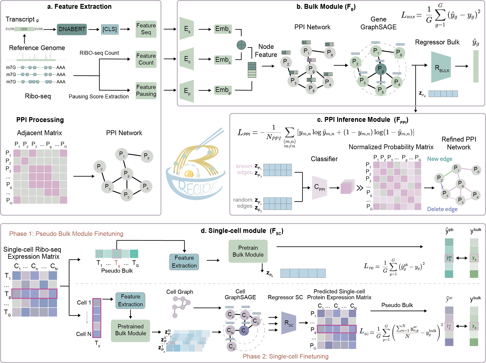

<h1 align="center">RECIPE bridges transcriptomics and proteomics with deep graph learning on Ribo-seq data</h1>

## Overview

Direct protein quantification is limited by cost and coverage of mass spectrometry and antibody-based assays. These challenges are especially severe at the single-cell level, where proteomics remains extremely restricted. Computational inference from RNA-seq is attractive but hindered by the mismatch between transcript and protein abundance. Ribosome profiling (Ribo-seq) captures ribosome occupancy and translational dynamics, but not absolute protein abundance. Here we introduce RECIPE, a deep graph learning framework that integrates Ribo-seq signals, transcript features, and protein–protein interactions to estimate protein abundance. Built on a GraphSAGE architecture, RECIPE leverages network connectivity to generalize beyond training-observed proteins, enabling accurate prediction of low-abundance and undetected proteins. RECIPE also refines protein–protein interaction networks by identifying missing and spurious edges, extending utility. Benchmarking across human and mouse datasets shows that RECIPE outperforms state-of-the-art approaches. RECIPE enables generalizable protein estimation at bulk and single-cell resolution and advances translatomics by linking translational dynamics with interactome refinement.




### Principal Contributions

1. **Translation-aware graph learning.**  
   A unified GraphSAGE framework links transcriptomics, translationomics (Ribo-seq occupancy & pausing), and proteomics using DNABERT sequence embeddings and PPI topology, explicitly modeling information flow from mRNA translation to protein abundance.

2. **Generalizes beyond detected proteins.**  
   Graph message passing over PPI propagates translation/expression signals to neighbors, enabling accurate prediction of low-abundance or undetected proteins (e.g., Pearson R ≈ 0.96) and improving proteome coverage for downstream analyses.

3. **Bulk ↔ single-cell applicability.**  
   Two-phase strategy—pseudo-bulk adaptation then cell–cell GNN—yields translation-informed single-cell protein estimation, providing a scalable alternative where single-cell proteomics is sparse.

4. **Interactome refinement.**  
   A PPI inference module removes spurious edges and adds missing ones, producing dataset-specific networks with stronger co-expression and pathway coherence (GO/KEGG/Reactome).

5. **Mechanistic insight into translation–protein decoupling.**  
   Systematic comparison of predicted vs. measured proteins reveals modules (e.g., cytoskeletal, ribosomal, nucleoproteins) where stability/stoichiometry/chromatin binding decouple abundance from ribosome occupancy.

## Installation
### Conda (recommended for PyTorch/CUDA)
```bash
conda create -n recipe python=3.9 -y
conda activate recipe
# Install PyTorch/CUDA (match your GPU/driver)
conda install pytorch pytorch-cuda=12.1 -c pytorch -c nvidia
# Then install the rest via pip
pip install -r requirements.txt
# Dev install
pip install -e .
```

See full list in **[requirements.txt](./requirements.txt)**.

Tip: PyTorch Geometric & friends must match your torch/CUDA versions. Follow https://pytorch-geometric.readthedocs.io
 for wheels.


## Prerequisites

Python ≥ 3.9

PyTorch ≥ 2.0

PyTorch Geometric (GraphSAGE)

Transformers (for DNABERT/sequence embeddings)

NumPy, Pandas, SciPy, scikit-learn

matplotlib (figures)

networkx (PPI IO/ops)

(Optional) scanpy/anndata for single-cell workflows


## Contact

Luying Su (luying.su@mail.mcgill.ca), Bowen Zhao (bowen.zhao@mail.mcgill.ca), Wei Song (songwei@ibms.pumc.edu.cn), Jun Ding (jun.ding@mcgill.ca) 
Affiliations: Meakins-Christie Laboratories, RI-MUHC, McGill University
