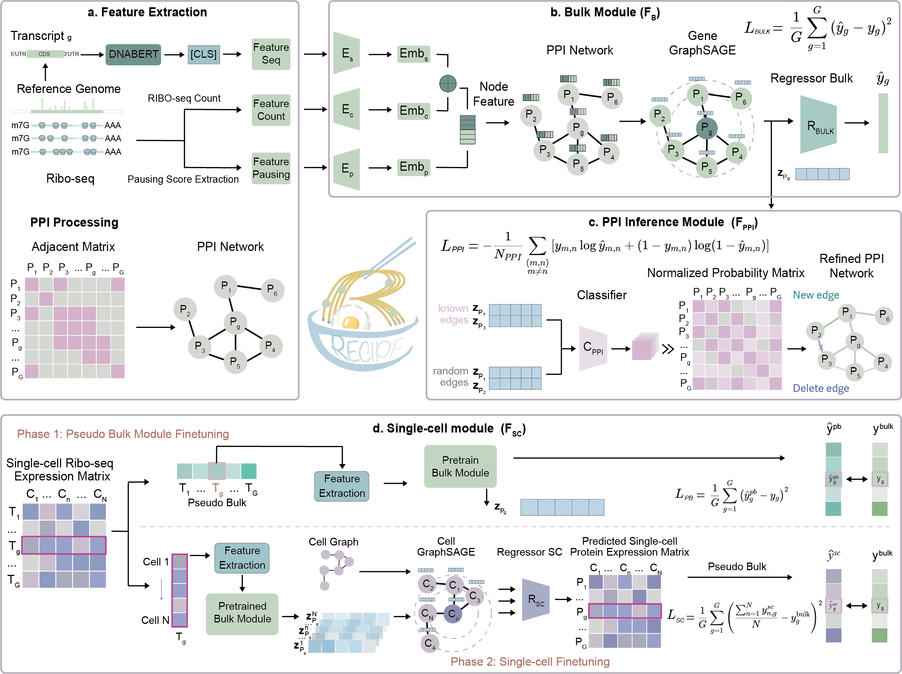

<h1 align="center">RECIPE bridges transcriptomics and proteomics with deep graph learning on Ribo-seq data</h1>


## Overview

RECIPE is a deep graph learning framework for estimating protein abundance from RNA/Ribo-seq signals, transcript sequence embeddings, and protein-protein interaction topology. The Python package lives in [`RECIPE/`](./RECIPE).



## Package Directory

Code, command-line runners, data layout, training notebooks, and detailed documentation are under [`RECIPE/`](./RECIPE).

## Modules

- Module A: bulk protein abundance prediction for proteins with measured labels.
- Module B: bulk inference for proteomics-undetected or unknown proteins.
- Module C: self-supervised PPI refinement.
- Module D: single-cell transfer with pseudo-bulk alignment and a cell-graph head.

## Install

Method 1: clone the repository and install from the local package directory:

```bash
git lfs install
git clone https://github.com/mcgilldinglab/RECIPE.git
cd RECIPE/RECIPE
git lfs pull

conda create -n recipe python=3.8 -y
conda activate recipe

# Install PyTorch and PyTorch Geometric for your CUDA or CPU setup first.
python -m pip install "torch>=2.1" "torch-geometric>=2.5"
python -m pip install -r requirements.txt
python -m pip install -e .
```

Method 2: install the package directly from GitHub:

```bash
conda create -n recipe python=3.8 -y
conda activate recipe

# Install PyTorch and PyTorch Geometric for your CUDA or CPU setup first.
python -m pip install "torch>=2.1" "torch-geometric>=2.5"
python -m pip install "git+https://github.com/mcgilldinglab/RECIPE.git@main#subdirectory=RECIPE"
```

If the package is installed directly from GitHub, keep data and checkpoints outside the Python environment and pass `--data-root /path/to/RECIPE/RECIPE/data` plus `--model-root /path/to/RECIPE/RECIPE/models`, or use the file-level input arguments shown in the reproduction guide.

## Quick Start

```bash
git lfs install
git clone https://github.com/mcgilldinglab/RECIPE.git
cd RECIPE/RECIPE
git lfs pull
python -m pip install -e . --no-deps
python scripts/run_smoke_demo.py \
  --data-dir examples/smoke_data \
  --device cpu \
  --output-dir outputs/smoke_demo
```

The smoke demo should finish in under 1 minute.

## Documentation

- Full package documentation: [`RECIPE/README.md`](./RECIPE/README.md)
- Reproduction commands and explicit input data paths: [`RECIPE/docs/reproduction.md`](./RECIPE/docs/reproduction.md)
- Data layout: [`RECIPE/docs/data.md`](./RECIPE/docs/data.md)
- Sanitized training notebooks: [`RECIPE/notebooks/training`](./RECIPE/notebooks/training)

## Contact

Luying Su (luying.su@mail.mcgill.ca), Bowen Zhao (bowen.zhao@mail.mcgill.ca), Wei Song (songwei@ibms.pumc.edu.cn), Jun Ding (jun.ding@mcgill.ca)

Affiliations: Meakins-Christie Laboratories, RI-MUHC, McGill University
